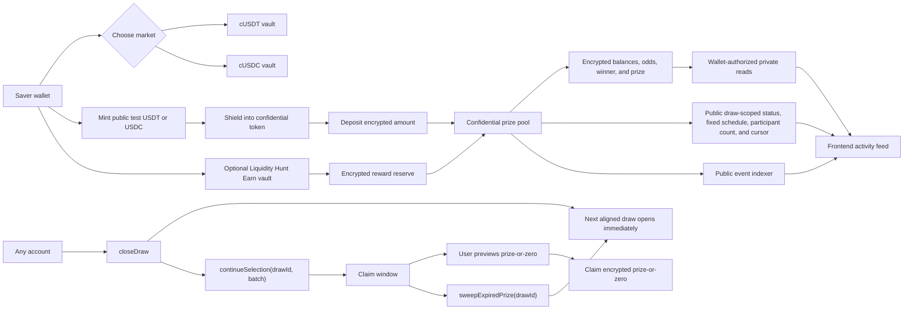

# Confidential PoolTogether

Confidential PoolTogether is a no-loss prize savings prototype built with Zama FHEVM. Users deposit confidential stablecoins, keep access to their principal, and enter weighted prize draws without publishing deposit amounts, balances, odds, winner identity, or prize amounts.

The repository is configured for two markets:

- `cUSDT`
- `cUSDC`

This project was built for the Zama Developer Program Mainnet Season 4. It is V5-style in product behavior: draw progression is permissionless, multiple prize markets are supported, and the interface separates saving, shielding, sending, earning, and draw verification. It is not a direct fork of PoolTogether V5's TWAB controller, liquidator, tiered prize pool, or VRGDA claimer.

## Features

- React and Vite frontend for the live vault workspace.
- Sepolia wallet support with explicit network gating.
- Zama browser relayer integration for encrypted inputs, proofs, permits, and user decryption.
- ERC-7984 cUSDT and cUSDC support using Zama's official Sepolia mock wrappers.
- Encrypted deposits, withdrawals, balances, prize previews, and prize claims.
- Fixed, epoch-aligned 24-hour entry draws with overlapping historical selection and claims.
- Permissionless draw lifecycle methods for finalizing, continuing draw-scoped selection, expiring, and sweeping prizes.
- Encrypted weighted winner selection with bounded scan batches.
- Confidential Liquidity Hunt vaults that track encrypted Earn TVL and simulate time-weighted reward accrual from a separately funded reserve.
- Supabase event indexing for public lifecycle events, with a bounded RPC fallback when the index is unavailable.

## Product Flow



## Repository Structure

```text
.
├── backend/    Supabase migrations and Sepolia event indexer
├── contracts/  Hardhat project, Solidity contracts, tests, and deployment scripts
├── docs/       Architecture and design notes
└── frontend/   Vite React application
```

## Requirements

- Node.js 20 or newer
- npm
- A Sepolia RPC endpoint
- A funded Sepolia deployer wallet for deployment and reward seeding
- Optional: Supabase project for indexed public activity

## Setup

Install dependencies:

```bash
npm install
```

Create a local environment file:

```bash
cp .env.example .env.local
```

Set the variables needed for the workflows you use:

```bash
SEPOLIA_RPC_URL=
DEPLOYER_PRIVATE_KEY=
ETHERSCAN_API_KEY=
VITE_SUPABASE_URL=
VITE_SUPABASE_PUBLISHABLE_KEY=
SUPABASE_SERVICE_ROLE_KEY=
```

Only `VITE_` variables are exposed to the browser. Keep deployer keys and Supabase service-role credentials server-side.

## Development

Run the frontend:

```bash
npm run dev
```

Build the frontend:

```bash
npm run build
```

Run frontend tests:

```bash
npm test
```

Run linting:

```bash
npm run lint
```

Run contract tests:

```bash
npm run contracts:test
```

Compile contracts:

```bash
npm run contracts:compile
```

Run the browser smoke test:

```bash
npm run browser:smoke
```

Run the production dependency gate:

```bash
npm run audit:prod
```

Inspect or resume the idempotent two-market live prize cycle over public Sepolia RPCs:

```bash
npm run contracts:live:cycle
LIVE_CYCLE_EXECUTE=1 npm run contracts:live:cycle
```

The first command is chain-read-only and does not require a private key. The execute form requires the current pool owner's `DEPLOYER_PRIVATE_KEY`; it seeds missing principal and direct testnet prize liquidity, finalizes the fixed entry period, advances selection by explicit historical draw ID, submits preview and claim transactions while a newer draw is open, withdraws principal, and records Etherscan links under `contracts/deployments/live-cycle-*.json`.

GitHub Actions runs lint, frontend tests, contract tests, the production build, the production dependency gate, and the Chrome browser smoke on pull requests and pushes to `main`. Configure `VITE_SEPOLIA_RPC_URL` and `VITE_SEPOLIA_FHE_RPC_URL` repository variables for dedicated CI reads; these browser endpoints are compiled into the public frontend and must not contain privileged credentials. Without them, the application uses its bounded public fallbacks.

## Contract Deployment

Deploy the default cUSDT pool:

```bash
npm run contracts:deploy
```

Deploy the cUSDC pool:

```bash
npm run contracts:deploy:usdc
```

Deploy Liquidity Hunt reward vaults:

```bash
npm run contracts:deploy:vault
npm run contracts:deploy:vault:usdc
```

Verify deployments:

```bash
npm run contracts:verify-deployment
npm run contracts:verify-deployment:usdc
npm run contracts:verify:vault
npm run contracts:verify:vault:usdc
npm run contracts:verify-source
npm run contracts:verify-source:usdc
```

Seed reward reserves:

```bash
REWARD_RESERVE=1 npm run contracts:fund:vault
REWARD_RESERVE=1 npm run contracts:fund:vault:usdc
```

Deployment manifests are written to `contracts/deployments/` and copied into `frontend/src/generated/`. The frontend reads those generated manifests through `frontend/src/lib/contracts.ts`.

## Current Sepolia Deployments

| Market | Pool | Reward vault | Draw 1 close |
| --- | --- | --- | --- |
| cUSDT | `0x7f05Ed06B957906f16013de908E825bd836e28d3` | `0xfC6DbFA68f86144e20846401febd52A87d39e13E` | `2026-09-01 14:13:12 UTC` |
| cUSDC | `0x66fCF1bB6C790176c770FaC028994fD375bF27ad` | `0x09e250E6105EB21053D32dbB705d836bAd8EC041` | `2026-09-01 14:13:48 UTC` |

Verified source:

- cUSDT pool: https://sepolia.etherscan.io/address/0x7f05Ed06B957906f16013de908E825bd836e28d3#code
- cUSDT reward vault: https://sepolia.etherscan.io/address/0xfC6DbFA68f86144e20846401febd52A87d39e13E#code
- cUSDC pool: https://sepolia.etherscan.io/address/0x66fCF1bB6C790176c770FaC028994fD375bF27ad#code
- cUSDC reward vault: https://sepolia.etherscan.io/address/0x09e250E6105EB21053D32dbB705d836bAd8EC041#code

Official Zama Sepolia wrappers:

| Token | Wrapper | Underlying |
| --- | --- | --- |
| cUSDT | `0x4E7B06D78965594eB5EF5414c357ca21E1554491` | `0xa7dA08FafDC9097Cc0E7D4f113A61e31d7e8e9b0` |
| cUSDC | `0x7c5BF43B851c1dff1a4feE8dB225b87f2C223639` | `0x9b5Cd13b8eFbB58Dc25A05CF411D8056058aDFfF` |

## Confidentiality Model

| Data | Visibility |
| --- | --- |
| Deposit and withdrawal amounts | Encrypted input bound to the target contract |
| User principal | Encrypted handle, decryptable by the user |
| Confidential token balance | Encrypted handle, decryptable by the user |
| Incrementally maintained draw weight and odds | Encrypted, contract-only |
| Winner address | Encrypted, contract-only |
| Prize amount | Encrypted prize-or-zero result, decryptable by the caller |
| Aggregate pool size | Encrypted, contract-only |
| Per-draw status, fixed schedules, participant count, and selection cursor | Public |

Participant addresses and transaction timing remain visible at the Ethereum account layer. This prototype does not claim account-level participation privacy.

## Draw Lifecycle

1. A user grants the pool a time-bounded ERC-7984 operator approval.
2. The user deposits encrypted cUSDT or cUSDC into the selected prize pool.
3. At the fixed daily cutoff, anyone can call `closeDraw()`; the next aligned entry draw opens immediately.
4. Anyone can call `continueSelection(drawId, maxAccounts)` to progress an older draw in bounded batches while the current draw accepts entries.
5. During the claim window, participants call `previewPrize(drawId)` to create a decryptable prize-or-zero result.
6. Participants call `claimPrize(drawId)` to receive the encrypted prize-or-zero transfer.
7. Anyone can call `sweepExpiredPrize(drawId)` after expiry; the encrypted remainder moves into the draw open at execution time.

## Supabase Event Index

The app can read public lifecycle events from Supabase. Browser clients only need the publishable key.

```bash
cd backend
npx supabase link --project-ref <project-ref>
npx supabase db push
cd ..
npm run events:index
```

The indexer stores finalized public events and checkpoints by chain and contract. If Supabase is not configured, the frontend falls back to bounded Sepolia RPC log reads.

## Security Notes

This code is unaudited and should not custody production funds.

The Liquidity Hunt reward vault is a testnet APY simulator. It checkpoints encrypted TVL when principal changes or prizes are funded, accrues a 12% annual target in proportion to elapsed time, and carries unpaid accrual when the reserve is exhausted. Rewards come only from a separately funded encrypted reserve, not from realized external strategy yield. The one-day funding cooldown limits transaction frequency; it does not create a new reward slice. Before mainnet use, replace the reserve simulator with an audited yield adapter, add broader invariant and fuzz testing, decentralize keeper operations, and complete an external audit.

The winner-selection implementation is intentionally bounded and supports at most 256 entrants per draw. Enrollment is draw-scoped, so a full historical draw cannot block a newer draw. Aggregate principal and prize custody are confidentially capped before inbound ERC-7984 transfers to prevent `euint64` wraparound.

The continuous-draw contracts are a breaking migration. The active manifests reference the verified replacement pools and capacity-aware reward vaults above. Earlier Sepolia addresses remain historical evidence and must not be treated as compatible with the new ABI.
